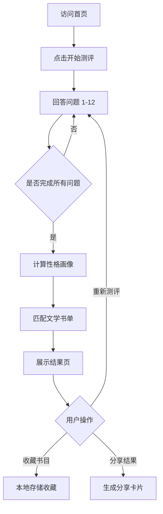

# 书魂 · 个性文学荐读 产品需求文档

## 1. 产品概述

「书魂」是一款根据用户性格特质推荐文学阅读作品的网站。通过 MBTI 偏好、生活习惯、阅读情境等多维度问题，刻画用户性格画像，并匹配与其气质相契合的文学作品，让每位读者遇见「命中注定」的那本书。
- 解决问题：面对浩瀚书海，读者常常不知哪本书真正契合自己的内心；传统榜单推荐千人一面，缺乏情感共鸣。
- 目标用户：18-40 岁热爱阅读或渴望重拾阅读的文学爱好者、文艺青年、自我探索者。
- 价值：将性格心理学与文学推荐融合，打造个性化、有温度的阅读入口。

## 2. 核心功能

### 2.1 用户角色
| 角色 | 注册方式 | 核心权限 |
|------|----------|----------|
| 访客 | 无需注册 | 完成测评、查看推荐、收藏书目（本地存储） |

### 2.2 功能模块
1. **首页（序章）**：品牌主张、测评入口、设计理念阐述、特色书目展示
2. **测评页（探心）**：多步骤性格问卷，含 MBTI 倾向、生活习惯、阅读情境、情感偏好四组问题
3. **结果页（命中）**：性格画像解析、匹配文学书单、书籍详情、收藏与重测

### 2.3 页面详情
| 页面 | 模块 | 功能描述 |
|------|------|----------|
| 首页 | Hero 序章 | 品牌标题、诗意引语、进入测评主按钮 |
| 首页 | 理念阐述 | 三栏说明：性格如何影响阅读、推荐逻辑、隐私承诺 |
| 首页 | 精选书目 | 横向卡片展示经典书目，营造文学氛围 |
| 首页 | 页脚 | 引言、版权、重置入口 |
| 测评页 | 进度指示 | 顶部进度条与题号显示 |
| 测评页 | 问题卡片 | 单题展示、选项卡片、上一题/下一题导航 |
| 测评页 | 性格维度雷达 | 实时显示已选答案形成的性格倾向预览（可选） |
| 结果页 | 性格画像 | 性格类型名称、特质关键词、诗意描述 |
| 结果页 | 推荐书单 | 3-5 本匹配书籍卡片，含书名、作者、简介、匹配理由 |
| 结果页 | 书籍详情 | 展开式详情：出版信息、 excerpts、气质契合分析 |
| 结果页 | 操作区 | 收藏书目、重新测评、分享结果 |

## 3. 核心流程

用户从首页进入，点击开始测评后进入多步骤问卷，依次回答 12 道题，系统根据答案计算性格维度得分，匹配文学书单，最终在结果页呈现个性化推荐。用户可收藏书籍或重新测评。

## 4. 用户界面设计

### 4.1 设计风格
- **设计方向**：编辑杂志风（Editorial / Magazine），融合古典书卷气与现代极简。整体如一本精装文学季刊的扉页。
- **主色调**：象牙白纸感底色 `#F5F0E6`，深墨主文字 `#1A1614`，古铜金强调色 `#A8741A`，暗红印章色 `#8B2C2C`
- **辅助色**：羊皮纸米黄 `#E8DFC8`、暮色灰 `#6B5D4F`
- **按钮风格**：细线描边按钮 + 古铜金填充主按钮，轻微凸起的立体感
- **字体**：
  - 显示字体：`Cormorant Garamond`（衬线，优雅文学感）
  - 中文显示：`Noto Serif SC`（思源宋体）
  - 正文字体：`Lora` / `Noto Sans SC` 衬线为主
  - 装饰字：`Italiana` 用于引语
- **布局**：宽屏居中、大量留白、卡片式、章节分隔线、左右页码式装饰
- **图标风格**：线性极简图标（lucide-react），点缀印章、羽毛笔、书签等装饰元素
- **细节**：纸张纹理、细密噪点、章节首字下沉、引文悬挂引号

### 4.2 页面设计概览
| 页面 | 模块 | UI 元素 |
|------|------|---------|
| 首页 | Hero 序章 | 全屏渐变纸感背景、居中大标题、首字下沉引语、滚动指示、装饰羽毛/印章 |
| 首页 | 理念阐述 | 三栏卡片、衬线标题、细线分隔、图标点缀 |
| 首页 | 精选书目 | 横向滚动书脊卡片、悬浮立体效果 |
| 测评页 | 进度条 | 顶部细线进度条、章节标记 |
| 测评页 | 问题区 | 大号衬线问题、卡片式选项、选中态金边描边 |
| 结果页 | 性格画像 | 雷达图/标签云、印章式性格类型徽章 |
| 结果页 | 书单 | 书脊式卡片、悬浮展开详情、匹配度百分比 |

### 4.3 响应式
- 桌面优先（1280px+），平板（768-1280px）单列布局，移动端（<768px）优化触控与字号
- 测评页移动端选项改为纵向全宽卡片

### 4.4 3D 场景指南
- 不适用（本产品为 2D 编辑设计风）
