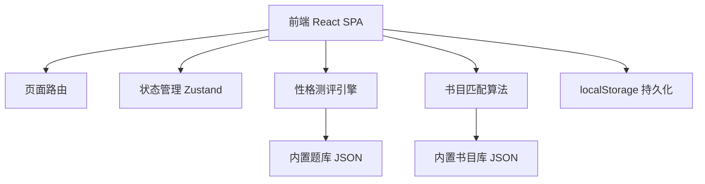
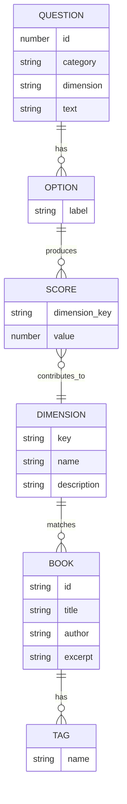

# 书魂 · 个性文学荐读 技术架构文档

## 1. 架构设计

纯前端单页应用，性格测评逻辑与书目匹配均在前端完成，无后端依赖。书目数据以静态 JSON 形式内置于项目中，收藏数据存储于浏览器 localStorage。



## 2. 技术说明
- **前端**：React@18 + TypeScript + tailwindcss@3 + vite
- **初始化工具**：vite-init（react-ts 模板）
- **后端**：无（纯前端）
- **数据库**：无（localStorage 本地持久化）
- **状态管理**：zustand
- **路由**：react-router-dom
- **图标**：lucide-react
- **字体**：Google Fonts（Cormorant Garamond、Noto Serif SC、Lora、Italiana）

## 3. 路由定义
| 路由 | 用途 |
|------|------|
| `/` | 首页（序章）：品牌介绍、测评入口、精选书目 |
| `/quiz` | 测评页（探心）：多步骤性格问卷 |
| `/result` | 结果页（命中）：性格画像与推荐书单 |

## 4. API 定义
无后端 API。所有数据为前端静态资源。

### 4.1 数据结构

**问题数据（questions.ts）**
```typescript
interface Question {
  id: number;
  category: 'mbti' | 'lifestyle' | 'reading' | 'emotion';
  dimension: string;        // 对应性格维度键，如 'EI'、'routine'
  text: string;
  options: QuestionOption[];
}
interface QuestionOption {
  label: string;
  scores: Record<string, number>;  // 维度得分
}
```

**书目数据（books.ts）**
```typescript
interface Book {
  id: string;
  title: string;
  author: string;
  year: string;
  genre: string;
  excerpt: string;
  description: string;
  tags: string[];                  // 气质标签
  matchProfile: Record<string, number>;  // 性格维度倾向，用于匹配
  coverColor: string;              // 书脊颜色
}
```

**性格画像（profile.ts）**
```typescript
interface PersonalityProfile {
  type: string;                    // 如「沉思的漫游者」
  traits: string[];                // 关键词
  description: string;             // 诗意描述
  scores: Record<string, number>;  // 各维度得分
}
```

## 5. 服务器架构
不适用（无后端）。

## 6. 数据模型

### 6.1 性格维度模型
本产品定义 6 个性格维度，每题选项对不同维度加分，最终归一化后形成性格画像：



### 6.2 维度定义
| 维度键 | 名称 | 高分倾向 | 低分倾向 |
|--------|------|----------|----------|
| `introversion` | 内省倾向 | 内向沉思 | 外向行动 |
| `intuition` | 直觉感知 | 抽象想象 | 具象现实 |
| `feeling` | 情感导向 | 共情细腻 | 理性分析 |
| `openness` | 开放求新 | 求新冒险 | 稳重传统 |
| `melancholy` | 忧郁气质 | 沉郁深邃 | 明朗乐观 |
| `solitude` | 独处偏好 | 独处静思 | 群聚社交 |

### 6.3 匹配算法
1. 累加各题选项得分，得到 6 维度原始分
2. 各维度归一化至 0-1
3. 计算每本书 `matchProfile` 与用户画像的余弦相似度
4. 取相似度 Top 5 作为推荐书单
5. 根据最高分维度组合生成性格类型名称与描述

### 6.4 收藏数据（localStorage）
```typescript
interface FavoriteStore {
  bookIds: string[];
  addFavorite: (id: string) => void;
  removeFavorite: (id: string) => void;
  isFavorite: (id: string) => boolean;
}
```
键名：`shuhun:favorites`
